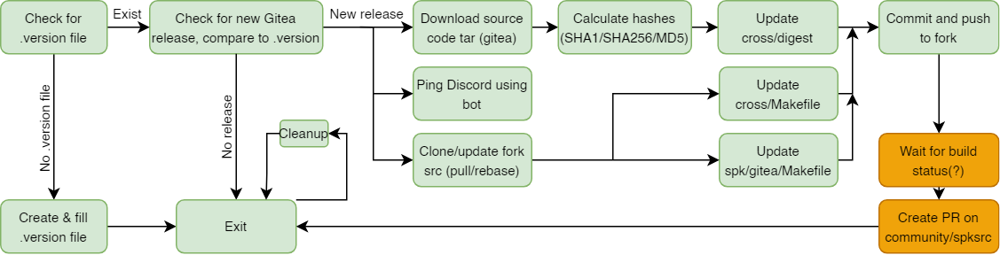

# GiteaReleaseGetter

---
## Work still in progress...

---
### Description
This script, run periodically, should automatically check for new release of Gitea on github and make all necessary
changes to update spksrc build files and prepare for Synology package update.

### Built With
* python3

### Flow diagram


* Green - DONE 
* Light yellow - IN PROGRESS
* Yelow - PLANNED

### Requirements
```bash
sudo apt update
sudo apt install python3 -y
pip3 install requests
sudo apt install bats curl jq -y
```

### How to run 
Script has no loop, so it should be run periodically using built-in scheduler (e.g. cron).

```bash
sudo apt update
sudo apt install cron -y
sudo systemctl enable cron
crontab -e
```
fill crontab to run every week:
```
0 0 * * 0 /usr/bin/python3 /path/to/file/main.py /path/to/file/logger.log
```
More on how to use crontab: [click](https://www.jcchouinard.com/python-automation-with-cron-on-mac/)

